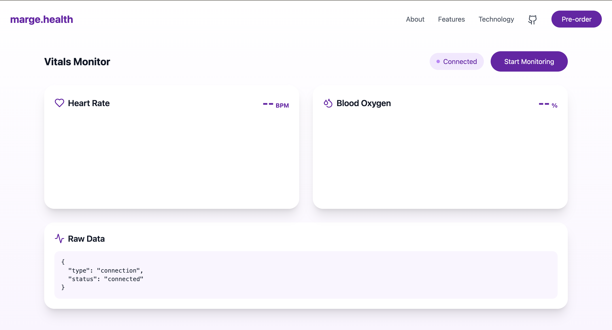
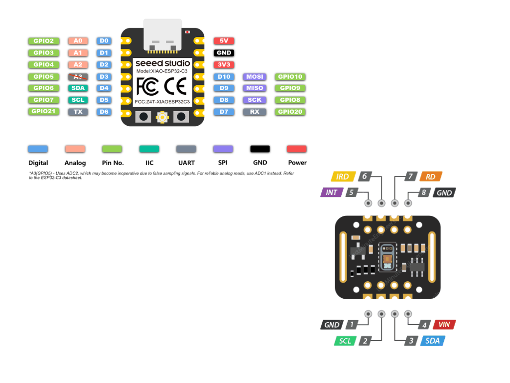

 # Marge Health - Sickle Cell Blood Flow Monitor

Marge Health provides continuous blood flow monitoring for sickle cell warriors through an innovative smart ring and companion app. This repository contains the source code and documentation for the Marge Health prototype development.

## Overview

The project consists of three main components:
1. ESP32-C3 based smart ring with MAX30105 sensor
2. WebSocket server for real-time data transmission
3. Web dashboard for vitals monitoring

## Hardware Requirements

- [Seeed Studio XIAO ESP32C3](https://www.seeedstudio.com/Seeed-XIAO-ESP32C3-p-5431.html)
- MAX30105 Breakout Board
- Connecting wires
- USB-C cable for programming

## Pinout

Connection diagram for XIAO ESP32C3 and MAX30105:

| MAX30105 Pin | XIAO ESP32C3 Pin |
|--------------|------------------|
| VIN          | 3.3V            |
| GND          | GND             |
| SDA          | D4 (SDA)        |
| SCL          | D5 (SCL)        |
| INT          | Not Connected   |

## Software Setup

### Arduino Setup
1. Install Arduino IDE
2. Add ESP32 board support
3. Install required libraries:
   - SparkFun MAX3010x Pulse and Proximity Sensor Library
   - WebSocketsClient
   - ArduinoJson

### WebSocket Server Setup
1. Navigate to \`Marge-health-web-socket-server\`
2. Install dependencies:
\`\`\`bash
npm install
\`\`\`
3. Start server:
\`\`\`bash
node server.js
\`\`\`

### Dashboard Setup
1. Install dependencies:
\`\`\`bash
npm install
\`\`\`
2. Start development server:
\`\`\`bash
npm run dev
\`\`\`

## Features

Current Features:
- Real-time heart rate monitoring
- SpO2 (Blood Oxygen) measurement
- WebSocket-based data transmission
- Interactive dashboard
- PDF report generation
- Medical device sound simulation

## Roadmap

### Phase 1 - Current
- [x] Basic vital monitoring
- [x] Real-time data transmission
- [x] Web dashboard

### Phase 2 - In Development
- [ ] Offline mode support
- [ ] Temperature sensing
- [ ] Sleeker design
- [ ] Mobile app development
- [ ] Data analytics

### Phase 3 - Future
- [ ] Machine learning for pattern recognition
- [ ] FDA approval process
- [ ] Clinical trials
- [ ] Mass production

## Contributing

We welcome contributions! 

## Development Environment

### ESP32 Development
- Arduino IDE 1.8.19 or newer
- ESP32 board package
- Required libraries installed via Arduino Library Manager

### Web Development
- Node.js 16.x or newer
- React 18
- Vite
- Tailwind CSS

## Troubleshooting

Common issues and solutions:

1. Sensor Not Found
   - Check I2C connections
   - Verify power supply voltage
   - Ensure correct I2C pins are used

2. WebSocket Connection Failed
   - Verify server is running
   - Check IP address configuration
   - Ensure network connectivity

## License

This project is open-source and available under the MIT License.

## Contact

- GitHub: [@MargeHealth](https://github.com/MargeHealth)
- Website: [marge.health](https://marge.health)

## Acknowledgments

Special thanks to:
- Seeedstudio Community
- SparkFun for the MAX30105 library
- The ESP32 community
- All contributors and supporters

---

Made with ❤️ by Marge Health Team
